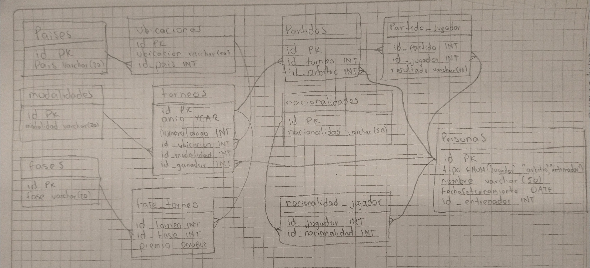

# Identificacion de entidades y atributos

1. **paises**

- id (PK)
- pais (VARCHAR 20, UC)

2. **ubicaciones**

- id (PK)
- ubicacion (VARCHAR 50, UC)
- id_pais (FK)

3. **modalidades**

- id (PK)
- modalidad (VARCHAR 20, UC)

4. **personas**

- id (PK)
- tipo (ENUM)
- nombre (VARCHAR 50, UC)
- fechaEntrenamiento (DATE)
- id_entrenador (FK)

5. **torneos**

- id (PK)
- anio (YEAR)
- numeroTorneo (INT)
- id_ubicacion (FK)
- id_modalidad (FK)
- id_ganador (FK)

6. **fases**

- id (PK)
- fase (VARCHAR 20, UC)

7. **fase_torneo**

- id_torneo (PK, FK)
- id_fase (PK, FK)
- premio (DOUBLE)

8. **partidos**

- id (PK)
- id_torneo (FK)
- id_arbitro (FK)

9. **partido_jugador**

- id_partido (PK. FK)
- id_jugador (PK, FK)
- resultado (VARCHAR 11)

10. **nacionalidades**

- id (PK)
- nacionalidad (VARCHAR 20, UC)

11. **nacionalidad_jugador**

- id_jugador (PK, FK)
- id_nacionalidad (PK, FK)

# Imagen "Modelo Fisico"



# Consultas

1. Dado un año y un torneo, composición y resultado de los partidos.

    ```sql
    SELECT
        per.nombre AS nombre_jugador,
        per1.nombre AS nombre_arbitro,
        pj.resultado AS resultados
    FROM torneos t
    JOIN partidos p ON t.id = p.id_torneo
    JOIN partido_jugador pj ON p.id = pj.id_partido
    JOIN personas per ON pj.id_jugador = per.id
    JOIN personas per1 ON p.id_arbitro = per1.id
    WHERE t.anio = 1979 AND t.numeroTorneo = 1;
    ```

2. Lista de árbitros que participaron en el torneo.

    ```sql
    SELECT DISTINCT p.nombre AS nombre_arbitro FROM personas p
    JOIN partidos pa ON p.id = pa.id_arbitro;
    ```

3. Ganancias percibidas en premios por un jugador a lo largo del torneo.

    ```sql
    SELECT p.nombre AS nombre_jugador, CONCAT('$',SUM(f.premio)) AS ganancias FROM personas p
    JOIN partido_jugador pj ON p.id = pj.id_jugador
    JOIN partidos pa ON pj.id_partido = pa.id
    JOIN torneos t ON pa.id_torneo = t.id
    JOIN fase_torneo f ON t.id = f.id_torneo
    WHERE p.id = 3
    GROUP BY p.id;
    ```

4. Lista de entrenadores que han entrenado a un jugador a lo largo del torneo y fechas en las que lo hizo.

    ```sql
    SELECT
        p.nombre AS nombre_jugador,
        GROUP_CONCAT(p1.nombre SEPARATOR ', ') AS lista_entrenadores,
        GROUP_CONCAT(CONCAT_WS(': ',p1.nombre, p.fechaEntrenamiento) SEPARATOR ', ') AS fechas_entrenamiento_por_entrenador
    FROM personas p
    JOIN personas p1 ON p.id_entrenador = p1.id
    WHERE p.nombre = 'Noah'
    GROUP BY nombre_jugador;
    ```

5. Connors gano Gerulaitis en Roland Garros en 1979 en cuartos de final en individuales masculinos por 6-3 4-6/7-5 6-0.

    ```sql
    SELECT DISTINCT
        p.nombre AS nombre_jugador,
        pj.resultado AS resultados,
        IF(p.id = (
                SELECT id FROM personas WHERE personas.nombre = 'Connors'
            ), 'Ganador', 'Perdedor'
        ) AS estado
    FROM personas p
    JOIN partido_jugador pj ON p.id = pj.id_jugador
    JOIN partidos pa ON pj.id_partido = pa.id
    JOIN torneos t ON pa.id_torneo = t.id
    JOIN fase_torneo f ON t.id = f.id_torneo
    WHERE t.id IN (
        SELECT id FROM torneos WHERE torneos.id_modalidad = (
            SELECT id FROM modalidades WHERE modalidades.modalidad = 'Individual masculino'
        )
    ) AND f.id_fase = (
        SELECT id FROM fases WHERE fases.fase = 'Cuartos de final'
    );
    ```

6. El señor Wilkinson arbitro ese partido.

    ```sql
    SELECT GROUP_CONCAT(partidos.id SEPARATOR ', ') AS id_partidos_arbitro_Wilkinson, (
        SELECT nombre FROM personas WHERE partidos.id_arbitro = personas.id
    ) AS nombre_arbitro
    FROM partidos WHERE partidos.id_arbitro = (
        SELECT id FROM personas WHERE personas.nombre = 'Wilkinson'
    )
    GROUP BY id_arbitro;
    ```

7. Alemania ha ganado dos veces las individuales masculinas de Wimbledon. Borg ha ganado 2.000.000 de dólares a lo largo de su participación en el Grand Slam.

    ```sql
    SELECT
        paises.pais,
        u.ubicacion,
        COUNT(t.id_ubicacion) AS cantidad_ganadas,
        p.nombre AS nombre_ganador, (
            SELECT CONCAT('$',SUM(premio))FROM fase_torneo WHERE id_torneo = 7
        ) AS ganancias_tiempo_participacion
    FROM paises
    JOIN ubicaciones u ON paises.id = u.id_pais
    JOIN torneos t ON u.id = t.id_ubicacion
    JOIN personas p ON t.id_ganador = p.id
    WHERE t.id_ubicacion = (
        SELECT id FROM ubicaciones WHERE ubicacion = 'Wimbledon'
    ) AND t.id_modalidad = (
        SELECT id FROM modalidades WHERE modalidad = 'Individual masculino'
    )
    GROUP BY t.id_ubicacion, p.nombre;
    ```

8. El ganador de Roland Garros de 1987 ganó 20.000 dólares.

    ```sql
    SELECT
        pa.pais,
        u.ubicacion,
        p.nombre,
        CONCAT('$',SUM(fa.premio)) AS cantidad_ganada
    FROM torneos t
    JOIN personas p ON t.id_ganador = p.id
    JOIN ubicaciones u ON t.id_ubicacion = u.id
    JOIN paises pa ON u.id_pais = pa.id
    JOIN fase_torneo fa ON t.id = fa.id_torneo
    WHERE u.ubicacion = 'Roland Garros' AND t.anio = 1987
    GROUP BY fa.id_torneo;
    ```

9. Noah ha jugado cuatro veces en dobles mixtos con Mandlikova.

    ```sql
    SELECT
        COUNT(pj.id_jugador) AS cantidad_jugadas,
        GROUP_CONCAT(CONCAT('(Noah:',REPLACE(pj.resultado,' ', ' Mandlikova:'),')') SEPARATOR ', ') AS resultados_obtenidos
    FROM partido_jugador pj, partidos p, torneos t WHERE pj.id_jugador = (
        SELECT id FROM personas WHERE nombre = 'Noah' LIMIT 1
    ) AND pj.id_partido = p.id AND p.id_torneo = t.id AND t.id_modalidad = (
        SELECT id FROM modalidades WHERE modalidad = 'Dobles mixtos'
    );
    ```

## Uso del Proyecto

Clona este repositorio en tu maquina local:

```BASH
git clone https://github.com/jstorra/TenisGrandSlamExamen.git
```

---

<p align="center">Developed by <a href="https://github.com/jstorra">@jstorra</a></p>